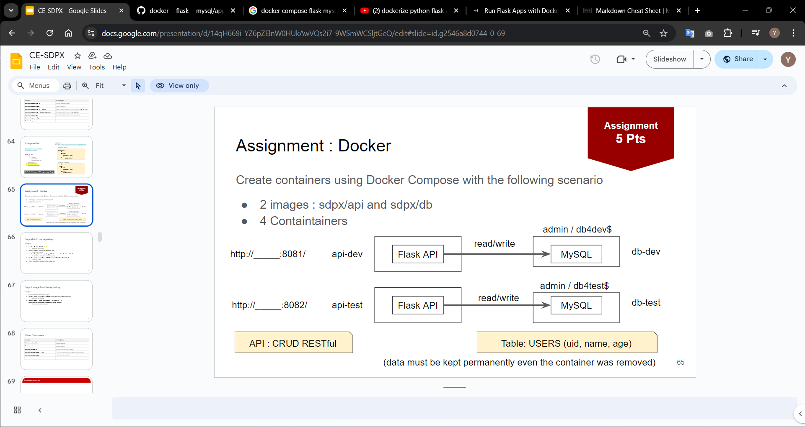

## Assignment : Docker 

**Github : https://github.com/maipk39196/docker---flask---mysql**  
**Ref SQL : https://www.bytebase.com/blog/top-mysql-commands-with-examples/**  
**mySQL Dockerfile Setup : https://codinggun.com/docker/mysql/#import-sql**

## **Step 1 setup directory**
### Clone from Github
**Github : https://github.com/maipk39196/docker---flask---mysql**  
## **Step 2 Dockerfile for build images**
ทำการสร้าง image สำหรับ sdpx/api และ sdpx/db  

#### dockerfile - sdpx/api
```
FROM python:3.12-alpine

WORKDIR /api-docker
ENV FLASK_APP=app.py
ENV FLASK_RUN_HOST=0.0.0.0
COPY requirements.txt requirements.txt
RUN pip install -r requirements.txt
EXPOSE 5000
COPY . .
CMD ["flask", "run"]
```
build image command with image name : ตรวจสอบให้แน่ใจว่าอยู่ใน path ที่มี dockerfile  
```
cd app
docker build -t sdpx/api .
```
#### dockerfile - sdpx/db
```
FROM mysql:latest

RUN chown -R mysql:root /var/lib/mysql/
COPY ./db.sql/ /docker-entrypoint-initdb.d/
```
build image command with image name : ตรวจสอบให้แน่ใจว่าอยู่ใน path ที่มี dockerfile
```
cd ..
cd db
docker build -t sdpx/db .
```
**Build Image Finished**
## **Step 3 Create docker-compose file for build containers**
docker-compose.yml
```
services:
  api-dev:
    container_name: api-dev
    image: sdpx/api
    ports:
      - 8081:5000
    environment:
      DATABASE_HOST: db-dev
      DATABASE_NAME: db-dev
      DATABASE_USER: admin
      DATABASE_PASSWORD: db4dev$
    depends_on:
      - db-dev

  api-test:
    container_name: api-test
    image: sdpx/api
    ports:
      - 8082:5000
    environment:
      DATABASE_HOST: db-test
      DATABASE_NAME: db-test
      DATABASE_USER: admin
      DATABASE_PASSWORD: db4test$
    depends_on:
      - db-test

  db-dev:
    container_name: db-dev
    image: mysql
    environment:
      MYSQL_ROOT_PASSWORD: root
      MYSQL_DATABASE: db-dev
      MYSQL_USER: admin
      MYSQL_PASSWORD: db4dev$
    volumes:
      - db_data_dev:/var/lib/mysql

  db-test:
    container_name: db-test
    image: mysql
    environment:
      MYSQL_ROOT_PASSWORD: root
      MYSQL_DATABASE: db-test
      MYSQL_USER: admin
      MYSQL_PASSWORD: db4test$
    volumes:
      - db_data_test:/var/lib/mysql

volumes:
  db_data_dev:
  db_data_test:
```
Build container command :
```
docker-compose up -d --build
```
## **Step 4 Setup Database**
เข้า bash เพื่อใช้ command sql
```
docker exec -it <Container_id> bash  

mysql -u <User> -p
```
คำสั่งที่ใช้ใน mySQL
```
SHOW DATABASES;

USE <database>;

SHOW TABLES;
```
สร้างตารางและข้อมูล
```
CREATE TABLE users (
    uid int not null AUTO_INCREMENT,
    name varchar(100) not null,
    age int (100) not null,
    PRIMARY KEY (uid)
);

INSERT INTO users (uid, name, age) VALUES
(121, 'Alice', 18),
(122, 'Bob', 17),
(123, 'Cindy', 25),
(124, 'Dan', 21);
```

## **Step 5 Test**
ทดสอบเข้า http://localhost:8081 และ http://localhost:8082 เพื่อทดสอบการทำ API  
GET : http://localhost:<port>/user
GET : http://localhost:<port>/user/121

#### ส่วน API ที่เหลือต้องทดสอบใน POSTMAN  
Import File POSTMAN : Flask API MySQL.postman_collection.json  

PUT : http://localhost:<port>/user/new  
DELETE : http://localhost:<port>/user/121
